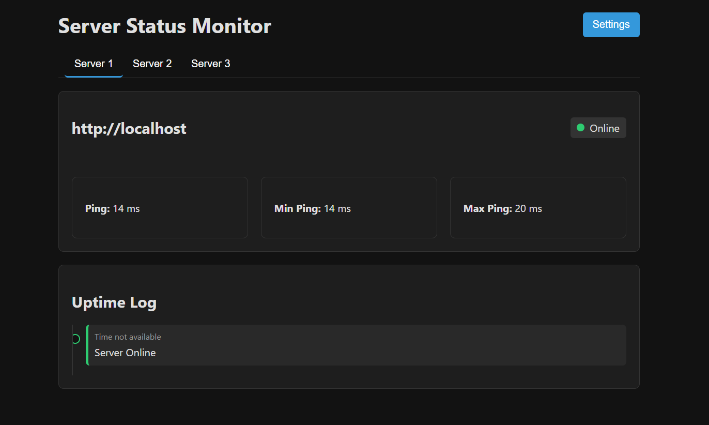

# **ESP32 Uptime Monitor**

Turn your ESP32 into a simple, powerful, and standalone uptime monitor. This project allows you to check the status of up to 3 independent servers or websites and receive instant, configurable notifications if one of them goes down.

## **Features**

* **Monitors up to 3 independent servers/websites.**
* Modern, responsive web interface with live status updates.
* **Tabbed Dashboard:** A clean, tabbed main page to view the status and separate uptime log for each server.
* **Per-Server Notifications:** Configure different notification settings for each server individually.
* **Multiple Notification Platforms:**

  * Discord (via Webhook)
  * Ntfy (with priority settings)
  * Telegram (via Bot)

* **Custom HTTP Actions:** Trigger custom URLs (for IFTTT, Home Assistant, etc.) for "online" and "offline" events on a per-server basis.
* **OTA Firmware Updates:** Update the firmware easily through the web interface.
* **Persistent Settings:** All configuration is saved on the ESP32's internal flash memory.

## **Getting Started**

### **1. Flash the Firmware**

Upload the latest .bin file to your ESP32 via the web updater, or flash the source code using the Arduino IDE.

### **2. Initial WiFi Setup**

On its first boot, or after a reset, you need to create a hotspot with your smartphone so the ESP32 can connect to it.

* **SSID:** hotspot123321
* **Password:** pw123456

Connect your phone or computer to this network. Then, open your web browser and navigate to http://[ESP32-IP].

Click the **"Settings"** button, go to the **"General"** tab, and enter your home WiFi credentials. Click **"Save \& Restart"**.

### **3. Main Configuration**

The ESP32 will now connect to your home network. You can find its new IP address in your router's client list or by watching the output in the Arduino IDE's Serial Monitor.

* Navigate to the ESP32's new IP address in your browser.
* Click **"Settings"** again. You can now configure each server in its respective tab ("Server 1", "Server 2", "Server 3").
* For each server, you can set the URL to monitor and its unique notification and action settings. An URL set to 0 will be inactive.

## **Important Notes**

### **Settings Reset on Update**

Each firmware version has an internal configuration number. When you update the firmware (either via the Arduino IDE or the web interface), the device will detect this change and **automatically reset all saved settings to their defaults**. This is an intentional safety feature to prevent conflicts with outdated settings.

**You will need to re-configure your WiFi and server settings after every firmware update.**

### **Manual Reset**

If you ever get locked out (for example, by entering the wrong WiFi credentials), you can perform a manual factory reset.

To do this, press and hold the **'BOOT' button** on your ESP32, then power the device on (or press and release the 'RST'' button while still holding 'BOOT'). Keep the 'BOOT' button held for about 10 seconds after power-on. This will wipe all saved settings and restart the device with its default configuration, ready for a new setup.

